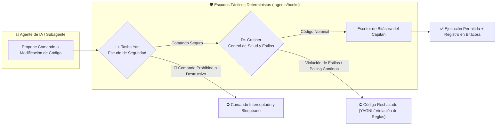
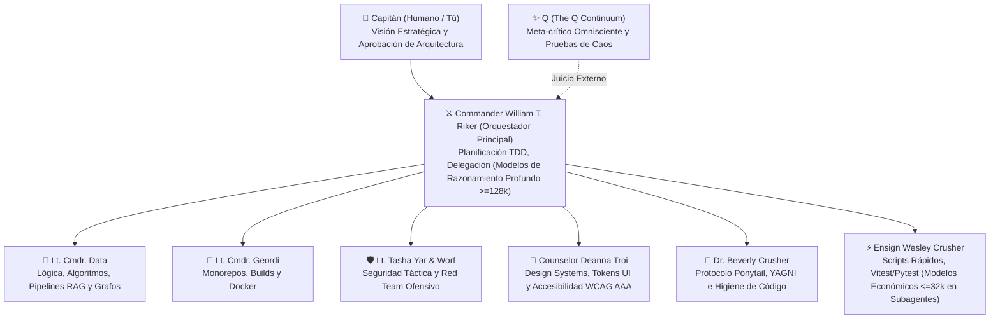

# ⚔️ ISS-Enterprise: Motor Universal de Andamiaje Multi-Agente y CLI Táctico

[](https://opensource.org/licenses/MIT)
[](https://nodejs.org/)
[](#)
[](#)

> *"En el Universo Espejo, la ISS Enterprise no es una nave de exploración científica: es un acorazado de combate forjado para la superioridad táctica, la disciplina de hierro y la conquista ágil de sistemas estelares."*

**ISS-Enterprise** es un motor de andamiaje (*scaffolding*) agnóstico y CLI táctico multi-agente. Transforma cualquier proyecto existente —o crea nuevos desde cero— en un acorazado de ingeniería autónomo gobernado por tripulantes de IA especializados y directivas deterministas de modelo.

Disponible en Inglés y Español ([English README](README.md)).

---

## ⚡ Capacidades Principales

### 1. 🛰️ Escáner Universal de Arquetipos
Detecta automáticamente el stack tecnológico sin requerir configuración previa y asigna el perfil de tripulación, directivas y skills correspondientes:
- **Monorepos Fullstack** (Turborepo, Next.js, NestJS, React Native / Expo, Drizzle ORM).
- **Portales de Contenido y SSG** (Astro, Biome, Playwright, estilos mixtos CSS + Tailwind).
- **Pipelines de Datos y RAG** (Python, Vector DBs, Docker, scrapers headless).
- **APIs de Backend y Microservicios** (Go, Rust, FastAPI, NestJS).
- **Proyectos Greenfield (Desde Cero)** (Genera la estructura de carpetas, código base y manifiestos).

### 2. 🧠 Asistente Interactivo con Opción "Otra" Garantizada
Nunca te encasilla en opciones predefinidas. Cada pregunta incluye la opción `[Otra / Personalizada]`:
- Al elegir `[Otra]`, se activa el **Motor de Investigación Heurística Autónoma** (`investigateCustomChoice`), deduciendo automáticamente los linters, convenciones de directorios y patrones óptimos para tecnologías no listadas (como Bun, Elysia, FastAPI, SolidJS o motores propietarios).

### 3. 🤖 Orquestación de Flota Heterogénea y Presupuesto de Contexto
Coordina sin fricción flotas de múltiples proveedores (Google Gemini, Anthropic Claude, DeepSeek, Alibaba Qwen, OpenAI, Ollama local):
- **Ventana de Contexto Amplia (>=128k - 1M tokens)**: Asignada a roles de alto razonamiento (Comandante Riker, Teniente Comandante Data, Q) para arquitectura de alto nivel, refactorización de AST y análisis de impacto en cascada.
- **Ventana de Contexto Reducida (8k - 32k tokens)**: Asignada a roles de economía rápida (Alférez Wesley Crusher) con prompts de sistema ultracompactos (menos de 800 tokens) y ejecución en subagentes aislados.
- **Protocolo de Lenguaje Cognitivo**: Recepción y entrega de mensajes en el idioma nativo del Capitán (ej. Español), mientras que el razonamiento interno y operaciones de AST se procesan en Inglés para un **ahorro de 30% a 50% en tokens BPE**.

### 4. 🎨 Gobernanza Adaptativa de Estilos (Sin Prohibiciones Hardcodeadas)
Adapta las directivas de estilos a la arquitectura real del proyecto:
- **Modo Mixto Permisivo** (ej. portales de contenido y sitios Astro híbridos): TailwindCSS combinado con CSS Modules.
- **Modo Estricto de Prohibición** (ej. arquitecturas empresariales con CSS nativo estricto): CSS3 puro + CSS Modules; el hook de la Dra. Crusher intercepta e impide la inserción de Tailwind.
- **Modo StyleSheet Nativo**: React Native / Expo sin abstracciones intermedias.
- **Modo Headless**: Desactiva por completo el linteo de UI/CSS en proyectos de datos, microservicios o herramientas CLI.

### 5. 🗜️ Motor de Skills Dinámico y Compactador Anticolisiones
Evita la saturación de contexto y colisiones de instrucciones fusionando cualquier cantidad de skills en 6 pilares canónicos:
1. `security-guardrails` (Tasha Yar: Semgrep, OWASP Top 10, Strix Red Team, Escudos de Comandos)
2. `design-system-and-ui` (Troi: WCAG AAA, tokens de diseño, CSS/Tailwind)
3. `code-health-and-ponytail` (Dra. Crusher: Protocolo Ponytail, YAGNI, prohibición de polling)
4. `fullstack-architecture` (Geordi: Monorepos, DDD, límites hexagonales)
5. `data-engineering-and-rag` (Data: Ingesta vectorial, pipelines ETL)
6. `workflow-and-coordination` (Riker: TDD estricto, Vitest/Pytest/Playwright)

### 6. 🔌 Tríada Indispensable de MCPs
Configura y pre-aprueba los tres servidores esenciales de Model Context Protocol:
1. **context7**: Documentación oficial y actualizada de 2026 sin alucinaciones.
2. **codebase-memory-mcp**: Grafo de conocimiento persistente y consultas Cypher para trazabilidad de dependencias.
3. **github**: Control de versiones, gestión de PRs y revisión automatizada (con fallback al CLI ligero `gh` para modelos locales con contexto limitado).

---

## 🗺️ Arquitectura Visual y Flujo de Acción Táctico

### 1. Ciclo de Vida: De la Detección a la Gobernanza Determinista
Cómo el motor táctico de ISS-Enterprise procesa cualquier repositorio para establecer los escudos de agentes:

```mermaid
graph TD
    USER["🚀 Usuario / CI (pnpm dlx iss-enterprise init)"] --> DETECTOR["🛰️ 1. Detector de Proyectos (detector.js)"]
    DETECTOR --> CHECK{"¿Existe Código?"}
    CHECK -->|Directorio Vacío| GREENFIELD["🌱 Modo Greenfield (scaffolder.js)"]
    CHECK -->|Proyecto Existente| SCAN["🔍 Análisis de Firmas y Arquetipo"]
    
    SCAN --> ADVISOR["🧠 2. Asesor Táctico (advisor.js)"]
    GREENFIELD --> ADVISOR
    ADVISOR -->|Preset Estándar| PRESET["Configuración Óptima del Stack"]
    ADVISOR -->|Opción '[Otra / Personalizada]'| HEURISTIC["⚡ Motor de Investigación Heurística"]
    
    PRESET --> FLEET["🤖 3. Asignador de Flota y Presupuesto de Contexto"]
    HEURISTIC --> FLEET
    FLEET --> SKILLS["🗜️ 4. Compactador de Skills (6 Pilares Canónicos)"]
    SKILLS --> MCP["🔌 5. Tríada Indispensable de MCPs (context7, memory, github)"]
    MCP --> GENERATOR["🏗️ 6. Generador de Gobernanza (generator.js)"]
    GENERATOR --> OUTPUT["🛡️ Salida: .agents/hooks, Agents.md, .mcp config"]
```

### 2. Bucle de Escudos Tácticos y Control de Calidad en Tiempo Real
Cómo los ganchos físicos interceptan de forma determinista las acciones propuestas por los agentes antes de ejecutarse:



### 3. Jerarquía de Mando y Asignación por Presupuesto de Contexto
La especialización de la tripulación aprovecha modelos de alto razonamiento y modelos económicos rápidos sin degradación de atención ni despilfarro de tokens:



---

## 📋 Requisitos y Entorno Recomendado

- **Node.js**: `>=18.0.0` (Soporte nativo de ES Modules).
- **Gestor de Paquetes**: **Se recomienda enfáticamente `pnpm >= 9.0.0`**.

### 📦 ¿Por qué se recomienda pnpm? (Seguridad y Ahorro de Espacio)

ISS-Enterprise y su flota multi-agente recomiendan **`pnpm`** sobre npm o yarn por dos razones estratégicas de ingeniería:

1. **🛡️ Seguridad Táctica (Cero Dependencias Fantasma / Phantom Dependencies):**
   `npm` y `yarn v1` aplanan el árbol en `node_modules`, permitiendo que el código o scripts importen paquetes transitivos no declarados explícitamente en `package.json`. `pnpm` crea una **estructura no plana basada en enlaces simbólicos (symlinks)**: los agentes autónomos y las herramientas solo pueden acceder a las dependencias directas declaradas, neutralizando riesgos en la cadena de suministro.

2. **💾 Almacén de Enlaces Duros (Aprovechamiento Masivo del Disco):**
   `pnpm` almacena todos los paquetes en un único almacén global deduplicado (`~/.local/share/pnpm/store`) y crea *hard links* hacia los proyectos. Al gobernar múltiples proyectos, monorepos y entornos de prueba de agentes, las dependencias comunes ocupan espacio físico en el disco **una sola vez**, ahorrando decenas de gigabytes.

---

## 🚀 Guía Rápida de Uso

### Inspeccionar un Proyecto Existente
Escanea cualquier repositorio para diagnosticar arquetipo, estilos, stack y tripulación recomendada:
```bash
# Recomendado con pnpm (rápido, aislado, sin desperdicio de disco):
pnpm dlx iss-enterprise inspect

# O vía npx:
npx iss-enterprise inspect

# Apuntando a una ruta específica:
pnpm dlx iss-enterprise inspect /ruta/hacia/proyecto

# Salida estructurada JSON para pipelines:
pnpm dlx iss-enterprise inspect /ruta/hacia/proyecto --json
```

### Inicializar la Gobernanza de Agentes
Inicia el asistente táctico interactivo:
```bash
pnpm dlx iss-enterprise init

# O adoptando las recomendaciones automáticas de inmediato:
pnpm dlx iss-enterprise init --yes
```

### Crear un Proyecto Desde Cero (Greenfield)
Crea una nueva base de operaciones con la estructura física y directivas ya listas:
```bash
pnpm dlx iss-enterprise new alpha-station
```

### Gestión de Skills: Crear y Compactar
Forja skills operativas a medida o compacta las existentes en pilares canónicos:
```bash
# Crear una nueva skill especializada con frontmatter YAML:
pnpm dlx iss-enterprise skills create database-migrations-guard

# Compactar y fusionar skills solapadas para eliminar el bloat de prompt:
pnpm dlx iss-enterprise skills compact

# Listar skills activas y recomendadas para el proyecto:
pnpm dlx iss-enterprise skills list
```

### Configurar y Extender Servidores MCP
Genera la tríada de sensores indispensables (`context7`, `codebase-memory-mcp`, `github`):
```bash
pnpm dlx iss-enterprise mcps
```
> [!TIP]
> **Extensión de MCPs y Servidores Personalizados**: Puedes conectar cualquier servidor MCP adicional (Postgres, Docker, Sentry, Figma) directamente en `.mcp/mcp-servers.config.json`. Consulta el [Manual de Operaciones Tácticas (MANUAL.es.md)](MANUAL.es.md) para ver la guía completa paso a paso.

---

## 👑 Cadena de Mando (La Tripulación Táctica del ISS)

| Oficial | Rol Corporativo | Área de Responsabilidad |
| :--- | :--- | :--- |
| **Capitán (Tú)** | Propietario / Human Executive | Requerimientos, aprobación de arquitectura, visión estratégica |
| **Comandante William T. Riker** | Orquestador Principal de IA | Planificación de tareas, despacho de subagentes, TDD |
| **Tte. Cmdte. Data** | Lógica y Sistemas | Algoritmos, pipelines RAG, máquinas de estado, lógica formal |
| **Tte. Cmdte. Geordi La Forge** | Jefe de Ingeniería | Paquetes de monorepo, rendimiento de compilación, Docker |
| **Teniente Tasha Yar** | Seguridad Táctica | Escudos perimétricos, análisis estático Semgrep, bloqueo de comandos |
| **Teniente Worf** | Seguridad Ofensiva / Red Team | Pruebas de estrés y penetración (Strix), auditoría de dependencias hostiles |
| **Consejera Deanna Troi** | Diseño y Ergonomía UX | Sistema de diseño, accesibilidad WCAG AAA, higiene de UI |
| **Dra. Beverly Crusher** | Salud Médica del Código | Protocolo Ponytail (YAGNI, diffs mínimos), bloqueo de polling continuo |
| **Alférez Wesley Crusher** | Automatización Rápida | Scripts veloces, ejecución de tests (Vitest, Pytest, Playwright) |
| **Q (El Continuo Q)** | Meta-Crítico Omnisciente | Auditoría temporal de decisiones, eliminación de sesgos, juicios de caos |

---

## 🧪 Suite de Pruebas Automatizadas

ISS-Enterprise incluye una suite de verificación exhaustiva e independiente de la máquina local, que valida todos los arquetipos, investigaciones heurísticas, asignación de modelos y ejecución real de hooks tácticos:

```bash
pnpm test
# O directamente: node test/suite.js
```

```
🛸 ISS-ENTERPRISE TACTICAL TEST RUNNER
----------------------------------------------------
  ✔ Detector: Correctly identifies Astro SSG with Mixed Styling (Astro Portal archetype)
  ✔ Detector: Correctly identifies Python Data/RAG Pipeline Headless (Python RAG Pipeline archetype)
  ✔ Detector: Correctly identifies Fullstack Monorepo with Strict CSS (Enterprise Monorepo archetype)
  ✔ Advisor: Heuristic investigation of Bun and ElysiaJS
  ✔ Advisor: Heuristic investigation of FastAPI
  ✔ Advisor: Unrecognized custom tech adopts fallback zero-dep governance
  ✔ FleetManager: Allocates reasoning models to Data/Riker and economy to Wesley
  ✔ FleetManager: Context Budgeting quarantines models with <= 32k context (Qwen 7b)
  ✔ SkillEngine: Tailors skills by archetype (No UI skills in Data RAG)
  ✔ SkillEngine: Compaction fuses multiple raw skills into canonical domains
  ✔ McpEngine: Builds indispensable triad (context7, codebase-memory-mcp, github)
  ✔ McpEngine: Replaces heavy GitHub MCP with lightweight gh CLI skill on small local models
  ✔ Advisor: Prioritizes Atomic Design UI recommendation for Astro stacks
  ✔ Advisor: Prioritizes Hexagonal Layers recommendation for Backend APIs
  ✔ Scaffolder & Generator: End-to-end greenfield creation with live hooks and Atomic Design
----------------------------------------------------
RESULTS: 15/15 Tests Passed.
```

---

## 🤝 Comunidad y Contribuciones

¡Son bienvenidas las adiciones tácticas, nuevos detectores de arquetipos y oficiales de tripulación! Consulta [CONTRIBUTING.md](CONTRIBUTING.md) para conocer las pautas de configuración, nuestra política estricta de Cero Dependencias y el flujo de Pull Requests.

Revisa [CHANGELOG.md](CHANGELOG.md) para consultar el historial de versiones y notas de lanzamiento.

---

## 📄 Licencia

MIT © [Favio Cesar Juan](https://github.com/favioCesarJuan)
