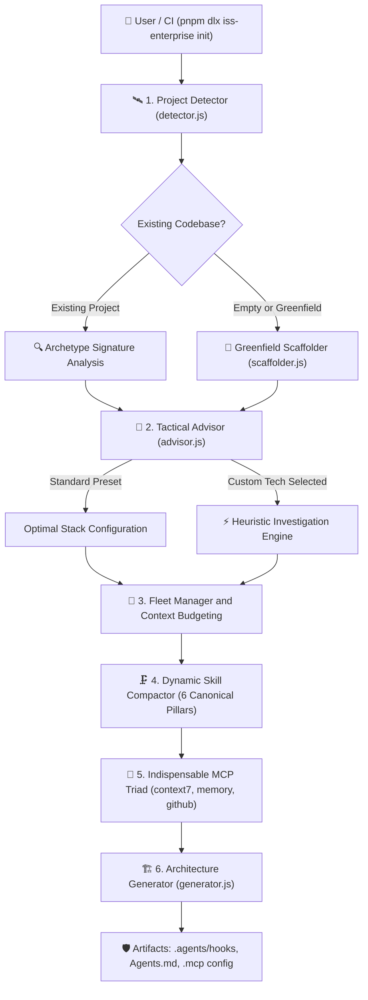
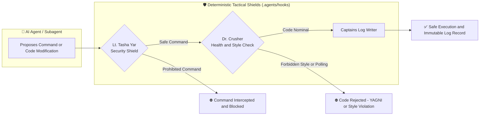
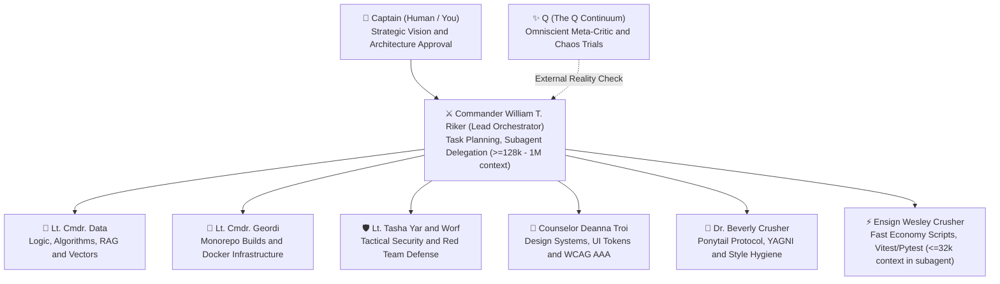

# ⚔️ ISS-Enterprise: Universal Multi-Agent Scaffolding Engine & Tactical CLI

[](https://opensource.org/licenses/MIT)
[](https://nodejs.org/)
[](#)
[](#)

> *"In the Mirror Universe, the ISS Enterprise is not an exploratory vessel—she is an armored dreadnought forged for tactical superiority, uncompromising discipline, and rapid planetary conquest."*

**ISS-Enterprise** is a generalist, cross-stack scaffolding CLI and multi-agent governance engine. It transforms any codebase—or creates new ones from scratch—into an autonomous, self-healing software engineering dreadnought powered by specialized AI agent personas and deterministic model hooks.

Available in English and Spanish ([README en Español](README.es.md)).

---

## ⚡ Key Capabilities

### 1. 🛰️ Cross-Stack Archetype Scanner
Zero-configuration scanner detects heterogeneous stacks and automatically configures appropriate officer rosters, hooks, and skills:
- **Fullstack Monorepos** (Turborepo, Next.js, NestJS, React Native / Expo, Drizzle ORM).
- **Content Portals & SSG** (Astro, Biome, Playwright, mixed CSS + Tailwind).
- **Data Engineering & RAG Pipelines** (Python, Vector DBs, Docker, headless data scraping).
- **Backend APIs & Microservices** (Go, Rust, FastAPI, NestJS).
- **Greenfield / Empty Starbases** (Scaffolds physical project trees and starter code from scratch).

### 2. 🧠 Interactive Advisor with Guaranteed Custom Write-In ("Otra")
Never trapped in rigid presets. Every multiple-choice question provides `[Otra / Personalizada]`:
- Selecting `[Otra]` triggers the **Autonomous Heuristic Investigation Engine** (`investigateCustomChoice`), inferring optimal linters, directory structures, and architecture conventions for unlisted frameworks (e.g. Bun, Elysia, FastAPI, SolidJS, custom internal engines).

### 3. 🤖 Mixed-Fleet Orchestration & Context Budgeting
Seamlessly coordinates heterogeneous model fleets (Google Gemini, Anthropic Claude, DeepSeek, Alibaba Qwen, OpenAI, local Ollama):
- **Large Context Allocation (>=128k - 1M tokens)**: Assigned to high-reasoning roles (Commander Riker, Lt. Cmdr. Data, Q) for complex architecture, AST refactors, and cascade impact analysis.
- **Constrained Context Quarantining (8k - 32k tokens)**: Assigned to fast economy roles (Ensign Wesley Crusher) with lean system prompts (under 800 tokens) and quarantined subagent execution.
- **Cognitive Language Protocol**: Inbound and outbound communications mirror the Captain's native language (e.g. Spanish), while internal deliberation and AST operations run in English for **30% to 50% BPE token savings**.

### 4. 🎨 Adaptive Styling Governance (Never Hardcoded)
Adapts styling rules to the project's actual architecture:
- **Permissive Mixed Mode** (e.g. content portals and hybrid Astro sites): TailwindCSS utilities paired with CSS Modules.
- **Strict Prohibition Mode** (e.g. enterprise architectures with strict native CSS): Pure CSS3 + CSS Modules; Dr. Crusher's hook blocks Tailwind injection.
- **Native StyleSheet Mode**: React Native / Expo zero-abstraction layout.
- **Headless Mode**: Completely disables UI/CSS linting for data pipelines, microservices, and CLIs.

### 5. 🗜️ Dynamic Skill Engine & Anti-Collision Compactor
Prevents instruction bloat and prompt collisions by compacting unlimited raw skills into 6 canonical pillars:
1. `security-guardrails` (Lt. Tasha Yar: Semgrep, OWASP Top 10, Strix Red Team, Command Shields)
2. `design-system-and-ui` (Counselor Troi: WCAG AAA, UI tokens, CSS/Tailwind governance)
3. `code-health-and-ponytail` (Dr. Crusher: Ponytail protocol, YAGNI, zero-polling)
4. `fullstack-architecture` (Lt. Cmdr. Geordi: Monorepos, DDD, Hexagonal boundaries)
5. `data-engineering-and-rag` (Lt. Cmdr. Data: Vector retrieval, ETL pipelines)
6. `workflow-and-coordination` (Commander Riker: Strict TDD, Vitest/Pytest/Playwright)

### 6. 🔌 Indispensable MCP Triad
Deploys and pre-approves the three essential Model Context Protocol servers:
1. **context7**: Live 2026 official documentation lookup without hallucinations.
2. **codebase-memory-mcp**: Persistent knowledge graph and Cypher queries for call-chain tracing.
3. **github**: Version control, pull request management, and automated issue reviews (with automatic lightweight `gh` CLI fallback for local small models).

---

## 🗺️ Visual Architecture & Tactical Flow

### 1. End-to-End Scaffolding & Governance Lifecycle
How the ISS-Enterprise tactical engine processes a codebase from initial scan to deterministic agent guardrails:



### 2. Runtime Tactical Shield & Quality Loop
How physical hooks deterministically intercept agent proposals before execution:



### 3. Crew Command Hierarchy & Context Window Budgeting
Model tiering ensures reasoning depth without token overflow or cost blowup:



---

## 📋 Requirements & Recommended Setup

- **Node.js**: `>=18.0.0` (Native ES Modules support required).
- **Package Manager**: **`pnpm >= 9.0.0` is strongly recommended**.

### 📦 Why pnpm is Recommended (Security & Disk Economy)

ISS-Enterprise and its multi-agent fleet strongly recommend **`pnpm`** over npm/yarn for two critical reasons:

1. **🛡️ Tactical Security (Zero Phantom Dependencies):**
   Standard `npm` and `yarn v1` create flat, hoisted `node_modules` trees where code can accidentally or maliciously import packages not explicitly declared in `package.json`. `pnpm` enforces a **strict, non-flat symlink structure**: autonomous agents and scripts can only access direct dependencies, effectively neutralizing phantom-dependency supply chain risks.

2. **💾 Content-Addressable Store (Massive Disk Savings):**
   `pnpm` stores all package files in a single, content-addressable global store (`~/.local/share/pnpm/store`) and creates hard links into project directories. When orchestrating multiple dreadnoughts, monorepos, and agent testbeds, identical dependencies are stored physically on disk **only once**, saving gigabytes of storage across your fleet.

---

## 🚀 Quickstart

### Inspect Any Project
Scan any repository to detect archetype, styling rules, tech stack, and recommended agent roster:
```bash
# Recommended with pnpm (fast, isolated, zero-disk bloat):
pnpm dlx iss-enterprise inspect

# Or via npx:
npx iss-enterprise inspect

# Inspect a specific target path:
pnpm dlx iss-enterprise inspect /path/to/my-project

# Structured JSON output for automated pipelines:
pnpm dlx iss-enterprise inspect /path/to/my-project --json
```

### ⚡ One-Shot Tactical Deployment (`engage`)
The fastest way to arm any repository: automatically detects the stack, provisions the tactical crew, generates `.agents/hooks`, and arms Git pre-commit shields in one step:
```bash
# Recommended with pnpm:
pnpm dlx iss-enterprise engage

# Or inside this repository:
pnpm engage
```

#### 🛡️ How Automatic Execution Works (Multi-Layer Tactical Defense)
When you run `engage`, ISS-Enterprise deploys three automatic defensive perimeters:
1. **Multi-AI Engine Contracts (`Agents.md`, `CLAUDE.md`, `.cursorrules`, `.windsurfrules`)**: Automatically synthesizes universal project rules and guardrails for any AI IDE or assistant (Claude Code/Desktop, Cursor, Windsurf, Antigravity, Gemini). Claude or Cursor will instantly adhere to Ponytail minimalism, testing standards, and forbidden commands.
2. **Agent Runtime Guardrail (`.agents/hooks.json`)**: Intercepts AI agent tool calls in real time. Commands like `rm -rf /` or unauthorized network scripts are blocked before touching your operating system.
3. **Native Git Pre-Commit Guardrail (`.git/hooks/pre-commit`)**: Automatically bound to your repository. Every time an agent or human runs `git commit`:
   ```text
   $ git commit -m "feat: tactical update"
   🛡️  [TASHA YAR]: Tactical shield online.
   🩺  [DR. CRUSHER]: Health check online. Tailwind allowed: false
   ```
   If security checks fail or code violates styling directives, Git automatically aborts the commit.

### Initialize Agent Governance (Interactive)
Launch the interactive tactical wizard to tailor hooks, skills, and model allocations:
```bash
pnpm dlx iss-enterprise init

# Or accept optimal automated defaults:
pnpm dlx iss-enterprise init --yes
```

### Forge a Greenfield Project
Scaffold a brand-new project with physical folder layout and starter code:
```bash
pnpm dlx iss-enterprise new alpha-station
```

### Manage Skills: Create & Compact
Forge custom operational skills or compact existing ones into canonical pillars:
```bash
# Create a new specialized skill with YAML frontmatter:
pnpm dlx iss-enterprise skills create database-migrations-guard

# Compact and fuse overlapping skills to eliminate prompt bloat:
pnpm dlx iss-enterprise skills compact

# List active and recommended skills:
pnpm dlx iss-enterprise skills list
```

### Configure & Extend MCP Servers
Deploy the indispensable sensor triad (`context7`, `codebase-memory-mcp`, `github`):
```bash
pnpm dlx iss-enterprise mcps
```
> [!TIP]
> **Extending MCPs & Custom Servers**: You can add any third-party MCP server (Postgres, Docker, Sentry, Figma) directly to `.mcp/mcp-servers.config.json`. See the [Tactical Operations Manual (MANUAL.md)](MANUAL.md) for complete step-by-step guides.

---

## 👑 Command Hierarchy (The ISS Tactical Crew)

| Officer | Corporate Role | Focus Domain |
| :--- | :--- | :--- |
| **Captain (You)** | Human Executive | Requirements, architecture approval, strategic direction |
| **Commander William T. Riker** | Lead AI Orchestrator | Task planning, subagent delegation, TDD execution |
| **Lt. Cmdr. Data** | Systems & Logic | Algorithms, RAG pipelines, state machines, formal logic |
| **Lt. Cmdr. Geordi La Forge** | Chief Engineer | Monorepo packages, build performance, Docker |
| **Lt. Tasha Yar** | Tactical Security | Security shields, Semgrep static analysis, command intercept |
| **Lt. Worf** | Offensive Security | Adversarial red teaming (Strix), penetration testing, supply chain audits |
| **Counselor Deanna Troi** | Design & UX | Design systems, WCAG AAA accessibility, styling hygiene |
| **Dr. Beverly Crusher** | Health & Quality | Ponytail protocol (YAGNI, minimal diffs), no-polling hook |
| **Ensign Wesley Crusher** | Automation Runner | Fast scripts, test execution (Vitest, Pytest, Playwright) |
| **Q (The Q Continuum)** | Omniscient Meta-Critic | Timeline analysis, bias challenge, chaos trials |

---

## 🧪 Automated Test Suite

ISS-Enterprise includes a comprehensive test suite covering all archetypes, heuristic investigations, context budgeting rules, and physical hook executions:

```bash
pnpm test
# Or: node test/suite.js
```

```
🛸 ISS-ENTERPRISE TACTICAL TEST RUNNER
----------------------------------------------------
  ✔ Detector: Correctly identifies Astro SSG with Mixed Styling (Astro Portal archetype)
  ✔ Detector: Correctly identifies Python Data/RAG Pipeline Headless (Python RAG Pipeline archetype)
  ✔ Detector: Correctly identifies Fullstack Monorepo with Strict CSS (Enterprise Monorepo archetype)
  ✔ Advisor: Heuristic investigation of Bun and ElysiaJS
  ✔ Advisor: Heuristic investigation of FastAPI
  ✔ Advisor: Unrecognized custom tech adopts fallback zero-dep governance
  ✔ FleetManager: Allocates reasoning models to Data/Riker and economy to Wesley
  ✔ FleetManager: Context Budgeting quarantines models with <= 32k context (Qwen 7b)
  ✔ SkillEngine: Tailors skills by archetype (No UI skills in Data RAG)
  ✔ SkillEngine: Compaction fuses multiple raw skills into canonical domains
  ✔ McpEngine: Builds indispensable triad (context7, codebase-memory-mcp, github)
  ✔ McpEngine: Replaces heavy GitHub MCP with lightweight gh CLI skill on small local models
  ✔ Advisor: Prioritizes Atomic Design UI recommendation for Astro stacks
  ✔ Advisor: Prioritizes Hexagonal Layers recommendation for Backend APIs
  ✔ Scaffolder & Generator: End-to-end greenfield creation with live hooks and Atomic Design
----------------------------------------------------
RESULTS: 15/15 Tests Passed.
```

---

## 🤝 Community & Contributing

We welcome tactical additions, archetype detectors, and new agent officers! Please review [CONTRIBUTING.md](CONTRIBUTING.md) for full setup instructions, Zero-Dependencies policies, and testing guidelines.

See [CHANGELOG.md](CHANGELOG.md) for the release notes and version history.

---

## 📄 License

MIT © [Favio Cesar Juan](https://github.com/favioCesarJuan)
